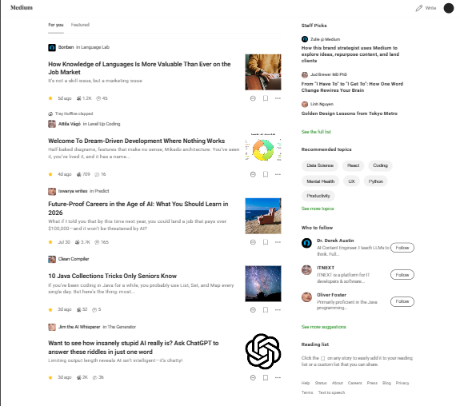

# Korna Frontend Engineer Assessment: Medium UI Clone

This project is a high-fidelity, responsive replica of the Medium.com feed page, built as a take-home assessment for the Frontend Engineer role at Korna.

---

### Live Demo & Repository

*   **Live Demo:** **[https://fe-job-assignment-yd8h.vercel.app/](https://fe-job-assignment-yd8h.vercel.app/)**
*   **GitHub Repo:** **[https://github.com/Sadiq-Teslim/fe-job-assignment](https://github.com/Sadiq-Teslim/fe-job-assignment)**

---

### 📸 Screenshot



---

### 🛠️ Tech Stack

- **React:** For building the user interface with a component-based architecture.
- **Vite:** As the blazing-fast build tool and development server.
- **TypeScript:** For static typing, improved developer experience, and a more robust codebase.
- **Styled Components:** For component-scoped, dynamic styling with full CSS power.
- **React Icons:** For a comprehensive library of high-quality SVG icons.

---

### ✨ Key Features & Approach

- **Mobile-First Responsive Design:** The application was styled for mobile devices first, with CSS media queries used to scale the layout up for tablet and desktop views, ensuring a seamless experience on any device.
- **Component-Based Architecture:** The UI was broken down into logical, reusable components (e.g., `ArticleCard`, `Sidebar`, `Header`) to create a maintainable and scalable structure.
- **High-Fidelity UI:** Meticulous attention was paid to matching the fonts, colors, spacing, and layout of the provided design references to create a pixel-perfect replica.
- **Static Data Hydration:** Since no backend was required, the application is populated via a typed, static `mockData.ts` file, cleanly separating the view layer from the data model.
- **Modern Development Practices:** The project uses transient props (`$`) in Styled Components to prevent invalid attributes from being passed to the DOM, ensuring a clean and warning-free console.

---

### ⚙️ Getting Started

To run this project locally, follow these steps:

1.  **Clone the repository:**
    ```bash
    git clone https://github.com/Sadiq-Teslim/fe-job-assignment.git
    ```

2.  **Navigate to the project directory:**
    ```bash
    cd fe-job-assignment
    ```

3.  **Install dependencies:**
    ```bash
    npm install
    ```

4.  **Run the development server:**
    ```bash
    npm run dev
    ```
    The application will be available at `http://localhost:5173`.